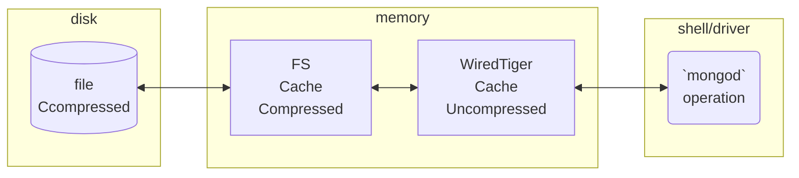
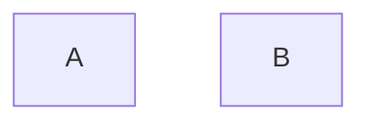
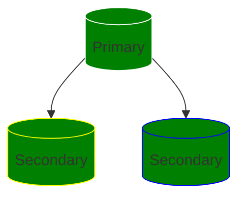
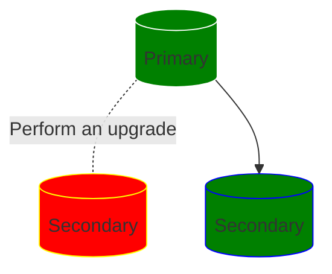
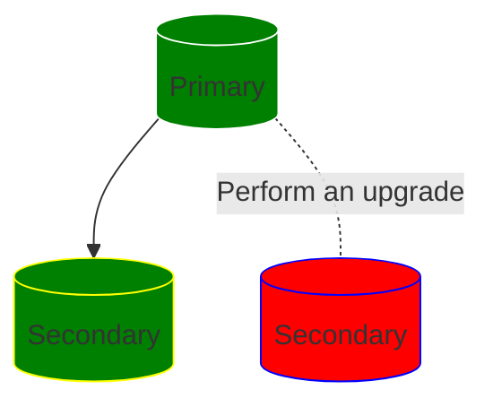

	# WiredTiger Internals
- Lowest component of MongoDB
- Data structure is similar to B+ tree #documentTodo 
- Responsible for storing data on disk and retrieving it by PK.
- It's a key value database
- For document it stored as key-value and for index it's stored as indexValue as key and document as value. ^wtKeyValDocIndex
- Supports Transactions
	- Mongod is consumer of these transactions to create atomically new document and inserting corresponding indexes
- Only writes a new document, never updates an existing one in place. Thus supporting [[Intro to Mongodb#MVCC|MVCC]]
- Data is compressed in Disk
	- Using block compression
	- And use prefix compression for Index

## Compression in storage

- As noted ![[#^wtKeyValDocIndex]] ^f4b60e
	- WT doesn't differentiate data it stores, unless for compression
- Collection files use block-store compression when written in disk but uncompressed in WiredTiger Cache
	- Snappy is default but can use Zlib, Zstd or leave uncompressed
- Index files use prefix compression
	- use         0 => use
	- used        1 => 0d
	- useful      2 => 0ful
	- usefully    3 => 2ly
	- usefulness  4 => 2ness
	- useless     5 => 0less
	- uselessness 6 => 5ness

## Page in Cache

- Collection and indexes (Essentially a WT Table) are split into pages.
- If loading collection, these page information is decompressed in memory.
- Then a WT Index (Not a MongoDB index) is built on top of the page image in memory.
	- This index contains mapping of what is the key, to where it's stored.
- If some write happens to the document in the key, that page image is considered as dirty... 
	- That makes it eligible to be written into disk via an eviction thread.
- All the consecutive changes are stacked on top of each other in a data structure called skip list.
	- Before version 4.2 this is stored in document level changes
	- After version 4.2 skip list is built as field level changes #version #gotchas 

## Cache Pressure
- ![[Operational Skills#^defaultCacheSize]]
- If we build too many updates in RAM before we are able to write in disk, we are creating pressure on cache. This is still a WT cache.
- This can happen because of various reasons like..
	- Someone has opened a snapshot cursor which hasn't closed for a long time
	- A majority commit point can't move forward
- Updates can only discarded when no reader would see them.
- WT Tracks oldest reader and keeps history after that.
- Size required for cache depends on how fast writes are happening
- Source of cache pressure
	- Operations that don't yield (AKA don't make way for other operations if they feel they're slow.)
	- Replication Lag, esp when `readConcern` majority is applied
	- Checkpoints

## Cache overflow
- If Cache pressure gets too high it can outgrow cache
- WT deals it by using `cache overflow` table in 3.6 and later #version #gotchas 
	- AKA a LookAside table called `WireTigerLAS.wt` 
	- Need to check if it grows too large
- Updates are written here and then page is evicted in cache.
- To indicate that this page needs to be read from LAS, a pointer is added in memory.
- If it's read, entire history is loaded in memory.
	- It's all or nothing.

## `diagnostic.data`
- Each second we collect
	- `serverstatus: db.serverStatus({tcmalloc:true})` 
	- `replSetGetStatus: rs.status()`
	- `collStats` for `local.oplog.rs.`
	- `/proc/stat`
	- `/proc/meminfo`
	- `/proc/diskstats`
- Once per file (Capped at 10mb), we collect
	- `getCommandLineOptions: db.adminCommand({getCmdLineOpts:true})`
	- `buildInfo: db.adminCommand({buildInfo:true})`
	- `hostInfo: db.adminCommand({hostInfo:true})`

## WireTiger performance issues
- Cache full
- Stalls during checkpoints
- Excessive memory use (OOM errors)
- Too many files

## WT Cache Size guidelines #recommendation 

- Can't rely on Page Faults, so look at `iostats` and `serverStatus()`
	- Disk Reads
	- Disk Writes
	- Bytes read into cache
	- Bytes written from cache
- If low disk reads + high bytes read in cache
	- Means #question
	- Increase WT Cache size
- Medium to high disk reads + bytes read into cache
	- Add RAM
- Medium to high disk reads + low bytes read into cache
	- decrease WT cache Size

## Cache eviction thresholds

- Read Cache
	- Below 80% utilisation: no cache eviction
	- 80%+ utilisation: evictions are done on background threads
	- 95%+ utilisation: evictions are done on application threads [^1]
	- 100% utilisation: no new operations until some evictions occur
- Dirty Cache: (As of 3.2.0 )
	- Below 5%: No special policy
	- 5%+: Writes are done using background threads
	- 20%+: Start using application threads to help. [^1]

[^1]: Application threads are those which are used by regular applications to read and write the data, not the actual application threads. This blocks regular operations.

## Tuning the cache

- Avoid changing anything in the cache unless...
	- Customer is having issues
	- We have clear understanding of their application

# Checkpoints
- MongoDB configures WireTiger to create checkpoints every 60 seconds.
- When writing to disk, WireTiger writes all data in a snapshot to disk in a consistent way across all data files
- This data becomes checkpoint, which ensures all the data is durable upto and including this checkpoint, thus checkpoint can act as recovery points.

# Throughput vs Latency

- Throughput: Queries/s
- Latency: Time to return
- Checkpoint may queue impacting latency

# Zero Downtime maintenance.

## Concept of Rolling updates 
- With Replica Set at centre stage of MongoDB. Making HA easy to manage.
- Many events that may take down entire databases, will not harm MongoDB that much because of rolling updates.
- Concept is as follows.
	- There is an upgrade event X (Like Mongo version updates, Index rebuild etc)
	- Perform this in one of the secondaries first.
		- Mostly we need this secondary to be shutdown once and may be have it move away from the Replicaset to make the update independent of other nodes.
		- If required test this change independently.
	- Once upgrade is verified, do the same in other secondaries.
	- When all secondaries have performed this operation, we will have a situation where all the secondaries are in desirable state.
	- Step Down current primary, a new primary will be selected from other upgraded secondaries. 
		- At that time we are running our replicaset to lates desirable state. 
		- We are still not running to our full capacity as our old Primary is still down and not in desirable state.
	- Upgrade old primary to desirable state, join it in replicaset, and now our rolling upgrade is finished without making entire replicaset down.

- Initial Stage

- Rolling Upgrade Stage 1

- Rolling Upgrade Stage 2

- Rolling Upgrade Stage 3 At this point client is connected to latest desired state.

- Rolling Upgrade Stage 4

- Final Stage At this point all our nodes are in desired state.

