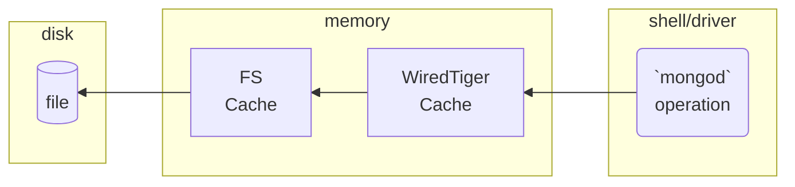

# WiredTiger Internals
- Lowest component of MongoDB
- Responsible for storing data on disk and retrieving it by PK.
- It's a key value database
- Supports Transactions
	- Mongod is consumer of these transactions to create atomically new document and inserting corresponding indexes
- Only writes a new document, never updates an existing one in place. Thus supporting [[Intro to Mongodb#MVCC|MVCC]]
- Data is compressed in Disk
	- Using block compression
	- And use prefix compression for Index

- 